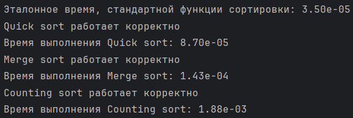

# Тестовое задание Intern Server Core Programmer Lesta Games

## Задние первое

В качестве аналогичного по функциональности было придложено решение с использованием битового оператора.

Данный метод более эффективный с точки зрения производительности, так как выполняется быстрее операции деления по модулю. Но данный метод менее интуитивно понятен при прочтении кода.

## Задание второе

Было предложено 2 класса реализовывающих циклический буфер FIFO:

1. Первый с использованием массива и двух индексов, первый указывающий на считываемый элемент, второй на ячейку для записи следующего элемента
   + Особенность данной реализации в том, что память для буфера выделяется сразу при создании, а значит необходимый объем памяти может быть подсчитанн на этапе компиляции
2. Второй с использование связанного списка и двух указателей на начало, откуда происходит считывание, и конец, куда происходит запись
   + Особенность данной реализации в том, что память на элемент списка выделяется в процессе выполнения при добавлении нового элемента и освобождается при удалении. Это позволяет экономить память в процессе выполнения, но замедляет скорость работы данной структуры данных.

## Задание третье

Было предоложено три алгоритма сортировки
1. Quick sort (Быстрая сортировка) алгоритм в среднем выполняется за время O(n*logn), но в зависимости от расположения элементов в входном масиве скорость падает до O(n^2). Требует O(n) затрат по памяти.
2. Merge sort (Сортировка слиянием) алгоритм также в среднем выполняется за O(n*logn), причем не скорость выполнения не падает от неудачной конфигурации входных данных. Требует O(n) затрат по памяти.
3. Сounting sort (Сортировка подсчетом) алгоритм выполняется за O(n+k), где k - размер диапозона значений в котором находятся числа входного массива. Требует O(k) затрат по памяти. 

Сначала был написан алгоритм для быстрой сортировки и протестирован на скорость выполнения, чтобы сравнить с встроенным алгоритмом сортировки. Так как он оказался почти в три раза медленне, была попытка написать алгоритм слиянием, он оказался медленне быстрой сортировки, скорее всего это связано с тем, что у сортировки слиянием значительно больше операций и стек вызовов рекурсии функций. Тогда была предпринята попытка написать алгоритм, которые работает за линейное время, была выбрана сортировка подсчетом, но так как она очень сильно зависит от параметра k, которые может быть значительно больше самого массива, как в примере на котором выполнялось тестирование, алгорит оказался еще медленне, но для массивов, где числа находятся в небольшом диапозоне, он был бы значительно быстрее остальных алгоритмов. 

